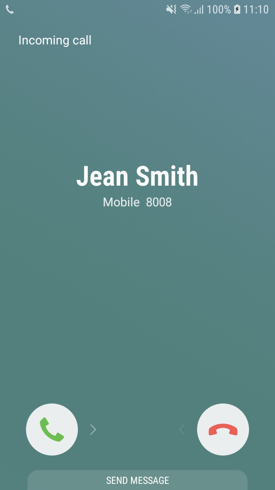
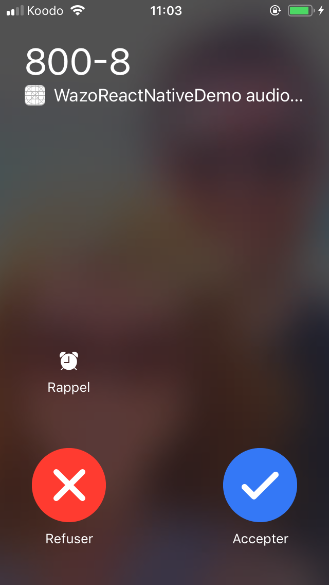

# React Native CallKeep

[](https://badge.fury.io/js/react-native-callkeep)
[](https://img.shields.io/npm/dm/react-native-callkeep.svg?maxAge=2592000)

**React Native CallKeep** utilises a brand new iOS 10 framework **CallKit** and Android **ConnectionService** to make the life easier for VoIP developers using React Native.

For more information about **CallKit** on iOS, please see [Official CallKit Framework Document](https://developer.apple.com/reference/callkit?language=objc) or [Introduction to CallKit by Xamarin](https://developer.xamarin.com/guides/ios/platform_features/introduction-to-ios10/callkit/)

For more information about **ConnectionService** on Android, please see [Android Documentation](https://developer.android.com/reference/android/telecom/ConnectionService) and [Build a calling app](https://developer.android.com/guide/topics/connectivity/telecom/selfManaged)

⚠️ **CallKit** and **ConnectionService** are only available on real devices, this library will not work on simulators.

#  Summary
- [Demo](#Demo)
- [Installation](#Installation)
- [Usage](#Usage)
  - [Expo](#Usage-with-Expo)
  - [Constants](#Constants)
  - [Android Self Managed](#Android-Self-Managed-Mode)
  - [API](#Api)
  - [Example](#Example)
- [PushKit](#PushKit)
- [Android 11](#Android-11)
- [Debug](#Debug)
- [Troubleshooting](#Troubleshooting)
- [Contributing](#Contributing)
- [License](#License)


# Demo
A demo of `react-native-callkeep` is available in the [wazo-react-native-demo](https://github.com/wazo-pbx/wazo-react-native-demo) repository.

#### Android


#### iOS


# Installation
```sh
npm install --save react-native-callkeep
# or
yarn add react-native-callkeep
```

- [iOS](docs/ios-installation.md)
- [Android](docs/android-installation.md)

# Usage

#### Setup

```js
import RNCallKeep from 'react-native-callkeep';

const options = {
  ios: {
    appName: 'My app name',
  },
  android: {
    alertTitle: 'Permissions required',
    alertDescription: 'This application needs to access your phone accounts',
    cancelButton: 'Cancel',
    okButton: 'ok',
    imageName: 'phone_account_icon',
    additionalPermissions: [PermissionsAndroid.PERMISSIONS.example],
    // Required to get audio in background when using Android 11
    foregroundService: {
      channelId: 'com.company.my',
      channelName: 'Foreground service for my app',
      notificationTitle: 'My app is running on background',
      notificationIcon: 'Path to the resource icon of the notification',
    }, 
  }
};

RNCallKeep.setup(options).then(accepted => {});
```

iOS only.

Alternative on iOS you can perform setup in `AppDelegate.m`. Doing this allows capturing events prior to the react native event bridge being up. Please be aware that calling setup in `AppDelegate.m` will ignore any subsequent calls to `RNCallKeep.setup();`.

```objective-c
@implementation AppDelegate
- (BOOL)application:(UIApplication *)application didFinishLaunchingWithOptions:(NSDictionary *)launchOptions
{ 
  self.bridge = [[RCTBridge alloc] initWithDelegate:self launchOptions:launchOptions];

  [RNCallKeep setup:@{
    @"appName": @"Awesome App",
    @"maximumCallGroups": @3,
    @"maximumCallsPerCallGroup": @1,
    @"supportsVideo": @NO,
  }];

  RCTRootView *rootView = [[RCTRootView alloc] initWithBridge:self.bridge
                                                   moduleName:@"App"
                                            initialProperties:nil];

  // ======== OTHER CODE REDACTED ==========

  return YES;
}

```

- `options`: Object
  - `ios`: object
    - `appName`: string (required)
      It will be displayed on system UI when incoming calls received
    - `imageName`: string (optional)
      If provided, it will be displayed on system UI during the call
    - `ringtoneSound`: string (optional)
      If provided, it will be played when incoming calls received; the system will use the default ringtone if this is not provided
    - `handleType`: string|array (optional)
      If provided, it will tell iOS what kind of handle(s) (number) your app can handle.
      - `generic`
      - `number` (default)
      - `email`
    - `includesCallsInRecents`: boolean (optional)
      If provided, calls will be shown in the recent calls when true and not when false (ios 11 and above) (Default: true)
    - `maximumCallGroups`: string (optional)
      If provided, the maximum number of call groups supported by this application (Default: 3)
    - `maximumCallsPerCallGroup`: string (optional)
      If provided, the maximum number of calls in a single group, used for conferencing (Default: 1, no conferencing)
    - `supportsVideo`: boolean (optional)
      If provided, whether or not the application supports video calling (Default: true)
    - `displayCallReachabilityTimeout`: number in ms (optional)
      If provided, starts a timeout that checks if the application is reachable and ends the call if not (Default: null)
      You'll have to call `setReachable()` as soon as your Javascript application is started.
  - `android`: object
    - `alertTitle`: string (required)
      When asking for _phone account_ permission, we need to provider a title for the `Alert` to ask the user for it
    - `alertDescription`: string (required)
      When asking for _phone account_ permission, we need to provider a description for the `Alert` to ask the user for it
    - `cancelButton`: string (required)
      Cancel button label
    - `okButton`: string (required)
      Ok button label
    - `imageName`: string (optional)
      The image to use in the Android Phone application's native UI for enabling/disabling calling accounts. Should be a 48x48 HDPI
      grayscale PNG image. Must be in your drawable resources for the parent application. Must be lowercase and underscore (_) characters
      only, as Java doesn't like capital letters on resources.
    - `additionalPermissions`: [PermissionsAndroid] (optional)
      Any additional permissions you'd like your app to have at first launch. Can be used to simplify permission flows and avoid
      multiple popups to the user at different times.
    - `selfManaged`: boolean (optional)
      When set to true, call keep will configure itself to run as a self managed connection service. This is an advanced topic, and it's best to refer to [Googles Documentation](https://developer.android.com/guide/topics/connectivity/telecom/selfManaged) on the matter.
      - `displayCallReachabilityTimeout`: number in ms (optional)
        If provided, starts a timeout that checks if the application is reachable and ends the call if not (Default: null)
        You'll have to call `setReachable()` as soon as your Javascript application is started.
      
`setup` calls internally `registerPhoneAccount`, `registerEvents` and `setSettings`.

You can alternatively just call `setSettings()` with the same option as `setup()` to define only your settings.

# Usage with Expo

To use this library with Expo, you will need to create a development build. Expo Go does not support custom native modules. For information on how to create and run a development build, visit: [Create a development build - Expo Documentation](https://docs.expo.dev/develop/development-builds/create-a-build/). You can use and test this library with a development build installed on your physical device (iOS and Android). 

# Constants

To make passing the right integer into methods easier, there are constants that are exported from the module.

```
const CONSTANTS = {
  END_CALL_REASONS: {
    FAILED: 1,
    REMOTE_ENDED: 2,
    UNANSWERED: 3,
    ANSWERED_ELSEWHERE: 4,
    DECLINED_ELSEWHERE: 5,
    MISSED: 6
  }
};

const { CONSTANTS as CK_CONSTANTS, RNCallKeep } from 'react-native-callkeep';

console.log(CK_CONSTANTS.END_CALL_REASONS.FAILED) // outputs 1
```

# Android Self Managed Mode
_This feature is available only on Android._

Android supports calling apps running in what's called "Self Managed". This means the apps are able (and required) to provide their own UI for managing calls. This includes both in call UI elements and incoming call notification UI. This method is all or nothing. You can't mix partial elements, such as having a custom in call view, but use the default incoming call UI.

To implement a self managed calling app, the following steps are necessary:
- Set `selfManaged: true` in setup.
- On an incoming call, from react native, call `RNCallKeep.displayIncomingCall`
- CallKeep will then fire the `showIncomingCallUi` event.
- When `showIncomingCallUi` is fired, you must show an incoming call UI. This would be a high priority notification ([Android: Display time-sensitive notifications](https://developer.android.com/training/notify-user/time-sensitive)).
- If the user answers the call, you call the appropriate RNCallKeep actions such as `answerCall` or `endCall`
- In certain cases Android will not allow you to show an incoming call notification. In that case the 'createIncomingConnectionFailed' event is fired and you should reject the incoming SIP Invite.

Self Managed calling apps are an advanced topic, and there are many steps involved in implementing them, but here are some things to keep in mind:
- React Native Headless Tasks are a great way to execute React Native code. Remember to start up the headless task as a Foreground Service.
- Android will deprioritize your high priority FCM notifications if you fail to show an incoming call ui when receiving them.
- You can avoid getting flooded with sticky foreground service notifications by not defining a Foreground Service for CallKeep, and instead managing this on your own.

⚠️ To be able to use the self managed mode, you'll have to add the `READ_CALL_LOG` permission in your `android/src/main/AndroidManifest.xml` file:
```
<uses-permission android:name="android.permission.READ_CALL_LOG" />
```

# API

| Method                                                            | Return Type         |  iOS | Android |
| ----------------------------------------------------------------- | ------------------- | :--: | :-----: |
| [getInitialEvents()](#getInitialEvents)                           | `Promise<String[]>` |  ✅  |   ✅    |
| [clearInitialEvents()](#clearInitialEvents)                       | `void>`             |  ✅  |   ✅    |
| [setAvailable()](#setAvailable)                                   | `Promise<void>`     |  ❌  |   ✅    |
| [setForegroundServiceSettings()](#setForegroundServiceSettings)   | `Promise<void>`     |  ❌  |   ✅    |
| [canMakeMultipleCalls()](#canMakeMultipleCalls)                   | `Promise<void>`     |  ❌  |   ✅    |
| [setCurrentCallActive()](#setCurrentCallActive)                   | `Promise<void>`     |  ❌  |   ✅    |
| [isCallActive()](#isCallActive)                                   | `Promise<Boolean>`  |  ✅  |   ❌    |
| [getCalls()](#getCalls)                                           | `Promise<Object[]>` |  ✅  |   ❌    |
| [displayIncomingCall()](#displayIncomingCall)                     | `Promise<void>`     |  ✅  |   ✅    |
| [answerIncomingCall()](#answerIncomingCall)                       | `Promise<void>`     |  ✅  |   ✅    |
| [startCall()](#startCall)                                         | `Promise<void>`     |  ✅  |   ✅    |
| [updateDisplay()](#updateDisplay)                                 | `Promise<void>`     |  ✅  |   ✅    |
| [endCall()](#endCall)                                             | `Promise<void>`     |  ✅  |   ✅    |
| [endAllCalls()](#endAllCalls)                                     | `Promise<void>`     |  ✅  |   ✅    |
| [rejectCall()](#rejectCall)                                       | `Promise<void>`     |  ✅  |   ✅    |
| [reportEndCallWithUUID()](#reportEndCallWithUUID)                 | `Promise<void>`     |  ✅  |   ✅    |
| [setMutedCall()](#setMutedCall)                                   | `Promise<void>`     |  ✅  |   ✅    |
| [setOnHold()](#setOnHold)                                         | `Promise<void>`     |  ✅  |   ✅    |
| [setConnectionState()](#setConnectionState)                       | `Promise<void>`     |  ❌  |   ✅    |
| [checkIfBusy()](#checkIfBusy)                                     | `Promise<Boolean>`  |  ✅  |   ❌    |
| [checkSpeaker()](#checkSpeaker)                                   | `Promise<Boolean>`  |  ✅  |   ❌    |
| [toggleAudioRouteSpeaker()](#toggleAudioRouteSpeaker)             | `Promise<void>`     |  ❌  |   ✅    |
| [supportConnectionService()](#supportConnectionService)           | `Promise<Boolean>`  |  ❌  |   ✅    |
| [hasPhoneAccount()](#hasPhoneAccount)                             | `Promise<Boolean>`  |  ❌  |   ✅    |
| [hasOutgoingCall()](#hasOutgoingCall)                             | `Promise<Boolean>`  |  ❌  |   ✅    |
| [hasDefaultPhoneAccount()](#hasDefaultPhoneAccount)               | `Promise<Boolean>`  |  ❌  |   ✅    |
| [checkPhoneAccountEnabled()](#checkPhoneAccountEnabled)           | `Promise<Boolean>`  |  ❌  |   ✅    |
| [isConnectionServiceAvailable()](#isConnectionServiceAvailable)   | `Promise<Boolean>`  |  ❌  |   ✅    |
| [backToForeground()](#backToForeground)                           | `Promise<void>`     |  ❌  |   ✅    |
| [removeEventListener()](#removeEventListener)                     | `void`              |  ✅  |   ✅    |
| [registerPhoneAccount()](#registerPhoneAccount)                   | `void`              |  ❌  |   ✅    |
| [registerAndroidEvents()](#registerAndroidEvents)                 | `void`              |  ❌  |   ✅    |


### getInitialEvents

If there were some actions performed by user before JS context has been created, this method would return early fired events. This is alternative to "didLoadWithEvents" event.

```js
RNCallKeep.getInitialEvents();
```

### clearInitialEvents

Clear all pending actions returned by `getInitialEvents()`.

```js
RNCallKeep.clearInitialEvents();
```

### setAvailable
_This feature is available only on Android._

Tell _ConnectionService_ that the device is ready to make outgoing calls via the native Phone app.
If not the user will be stuck in the build UI screen without any actions.
Eg: Call it with `false` when disconnected from the sip client, when your token expires, when your user log out ...
Eg: When your used log out (or the connection to your server is broken, etc..), you have to call `setAvailable(false)` so CallKeep will refuse the call and your user will not be stuck in the native UI.

```js
RNCallKeep.setAvailable(true);
```

### setForegroundServiceSettings
_This feature is available only on Android._

Configures the [Foreground Service](https://developer.android.com/about/versions/11/privacy/foreground-services) used for Android 11 to get microphone access on background.
Similar to set the `foregroundService` key in the `setup()` method.

```js
RNCallKeep.setForegroundServiceSettings({
    channelId: 'com.company.my',
    channelName: 'Foreground service for my app',
    notificationTitle: 'My app is running on background',
    notificationIcon: 'Path to the resource icon of the notification',
});
```

### canMakeMultipleCalls
_This feature is available only on Android._

Disable the "Add call" button in ConnectionService UI.

```js
RNCallKeep.canMakeMultipleCalls(false); // Enabled by default
```

- `active`: boolean
  - Tell whether the app is ready or not

### setCurrentCallActive
_This feature is available only on Android._

Mark the current call as active (eg: when the callee has answered).
Necessary to set the correct Android capabilities (hold, mute) once the call is set as active.
Be sure to set this only after your call is ready for two way audio; used both incoming and outgoing calls.

```js
RNCallKeep.setCurrentCallActive(uuid);
```

- `uuid`: string
  - The `uuid` used for `startCall` or `displayIncomingCall`

### isCallActive
_This feature is available only on IOS._

Returns true if the UUID passed matches an existing and answered call. 
This will return true ONLY if the call exists and the user has already answered the call. It will return false 
if the call does not exist or has not been answered. This is exposed to both React Native and Native sides.
This was exposed so a call can be canceled if ringing and the user answered on a different device.

```js
RNCallKeep.isCallActive(uuid);
```

- `uuid`: string
  - The `uuid` used for `startCall` or `displayIncomingCall`


### getCalls

_This feature is available only on IOS._

Returns a Promise. The result will be an array with all current calls and their states.

```js
RNCallKeep.getCalls();

response:
[{
  callUUID: "E26B14F7-2CDF-48D0-9925-532199AE7C48",
  hasConnected: true,
  hasEnded: false,
  onHold: false,
  outgoing: false,
}]
```

### displayIncomingCall

Display system UI for incoming calls

```js
RNCallKeep.displayIncomingCall(uid, handle, localizedCallerName = '', handleType = 'number', hasVideo = false, options = null);
```

- `uuid`: string
  - An `uuid` that should be stored and re-used for `stopCall`.
- `handle`: string
  - Phone number of the caller
- `localizedCallerName`: string (optional)
  - Name of the caller to be displayed on the native UI
- `handleType`: string (optional, iOS only)
  - `generic`
  - `number` (default)
  - `email`
- `hasVideo`: boolean (optional, iOS only)
  - `false` (default)
  - `true` (you know... when not false)
- `options`: object (optional)
  - `ios`: object
    - `supportsHolding`: boolean (optional, default true)
    - `supportsDTMF`: boolean (optional, default true)
    - `supportsGrouping`: boolean (optional, default true)
    - `supportsUngrouping`: boolean (optional, default true)
  - `android`: object (currently no-op)

### answerIncomingCall

Use this to tell the sdk a user answered a call from the app UI.

```js
RNCallKeep.answerIncomingCall(uuid)
```
- `uuid`: string
  - The `uuid` used for `startCall` or `displayIncomingCall`


### startCall

When you make an outgoing call, tell the device that a call is occurring. The argument list is slightly
different on iOS and Android:

iOS:
```js
RNCallKeep.startCall(uuid, handle, contactIdentifier, handleType, hasVideo);
```

Android:
```js
RNCallKeep.startCall(uuid, handle, contactIdentifier);
```

- `uuid`: string
  - An `uuid` that should be stored and re-used for `stopCall`.
- `handle`: string
  - Phone number of the callee
- `contactIdentifier`: string
  - The identifier is displayed in the native call UI, and is typically the name of the call recipient.
- `handleType`: string (optional, iOS only)
  - `generic`
  - `number` (default)
  - `email`
- `hasVideo`: boolean (optional, iOS only)
  - `false` (default)
  - `true` (you know... when not false)


### updateDisplay
Use this to update the display after an outgoing call has started.

```js
RNCallKeep.updateDisplay(uuid, displayName, handle)
```
- `uuid`: string
  - The `uuid` used for `startCall` or `displayIncomingCall`
- `displayName`: string (optional)
  - Name of the caller to be displayed on the native UI
- `handle`: string
  - Phone number of the caller
- `options`: object (optional)
  - `ios`: object
    - `hasVideo`: boolean (optional)
    - `supportsHolding`: boolean (optional)
    - `supportsDTMF`: boolean (optional)
    - `supportsGrouping`: boolean (optional)
    - `supportsUngrouping`: boolean (optional)
  - `android`: object (currently no-op)

### endCall

When finish an incoming/outgoing call.  
(When user actively chooses to end the call from your app's UI.)

```js
RNCallKeep.endCall(uuid);
```

- `uuid`: string
  - The `uuid` used for `startCall` or `displayIncomingCall`

### endAllCalls

End all ongoing calls.

```js
RNCallKeep.endAllCalls();
```

### rejectCall

When you reject an incoming call.

```js
RNCallKeep.rejectCall(uuid);
```

- `uuid`: string
  - The `uuid` used for `startCall` or `displayIncomingCall`

### reportEndCallWithUUID

Report that the call ended without the user initiating.  
(Not ended by user, is usually due to the following reasons)


```js
RNCallKeep.reportEndCallWithUUID(uuid, reason);
```

- `uuid`: string
  - The `uuid` used for `startCall` or `displayIncomingCall`
- `reason`: int
  - Reason for the end call
    - Call failed: 1
    - Remote user ended call: 2
    - Remote user did not answer: 3
    - Call Answered elsewhere: 4
    - Call declined elsewhere: 5 (on Android this will map to Remote user ended call if you use the constants)
    - Missed: 6 (on iOS this will map to remote user ended call)
  - Access reasons as constants
  ```js
  const { CONSTANTS as CK_CONSTANTS, RNCallKeep } from 'react-native-callkeep';

  RNCallKeep.reportEndCallWithUUID(uuid, CK_CONSTANTS.END_CALL_REASONS.FAILED);
  ```

### setMutedCall

Switch the mic on/off.

```js
RNCallKeep.setMutedCall(uuid, true);
```

- `uuid`: string
  - uuid of the current call.
- `muted`: boolean

### setOnHold

Set a call on/off hold.

```js
RNCallKeep.setOnHold(uuid, true)
```

- `uuid`: string
  - uuid of the current call.
- `hold`: boolean

### setConnectionState

_This feature is available only on Android._

Change the state of the call

```js
RNCallKeep.setConnectionState(uuid, state)
```

- `uuid`: string
  - uuid of the current call.
- `state`: [See Connection.STATE_*](https://developer.android.com/reference/android/telecom/Connection#STATE_ACTIVE) documentation

### checkIfBusy

_This feature is available only on IOS._

Checks if there are any active calls on the device and returns a promise with a boolean value (`true` if there're active calls, `false` otherwise).

```js
RNCallKeep.checkIfBusy();
```

### checkSpeaker

_This feature is available only on IOS._

Checks if the device speaker is on and returns a promise with a boolean value (`true` if speaker is on, `false` otherwise).

```js
RNCallKeep.checkSpeaker();
```

### toggleAudioRouteSpeaker

_This feature is available only on Android._

Update the audio route of Audio Service on Android with a `routeSpeaker` boolean value (`true` if speaker need on, `false` otherwise).
When Phone call is active, Android control the audio via connection service. so this function help to toggle the audio to Speaker or wired/ear-piece or vice-versa 

```js
RNCallKeep.toggleAudioRouteSpeaker(uuid, true);
```

- `uuid`: string
  - uuid of the current call.
- `routeSpeaker`: boolean

### getAudioRoutes

Get the list of available audio routes. i.e. bluetooth, wired/ear-piece, speaker and phone.

```js
await RNCallKeep.getAudioRoutes(): AudioRoute;
```

```
type AudioRoute = {
    name: string,
    type: string
}
```

### setAudioRoute

Set audio route using a route from `getAudioRoutes`.

```js
await RNCallKeep.setAudioRoute(uuid, routeName);
```

- `uuid`: string
  - uuid of the current call.
- `routeName`: String
  - AudioRoute.name. 

### supportConnectionService

_This feature is available only on Android._

Tells if `ConnectionService` is available on the device (returns a boolean).

```js
RNCallKeep.supportConnectionService();
```

### hasPhoneAccount (async)

_This feature is available only on Android._

Checks if the user has enabled the [phone account](https://developer.android.com/reference/android/telecom/PhoneAccount) for your application.
A phone account must be enable to be able to display UI screen on incoming call and make outgoing calls from native Contact application.

Returns a promise of a boolean.

```js
await RNCallKeep.hasPhoneAccount();
```

### hasOutgoingCall (async)

_This feature is available only on Android, useful when waking up the application for an outgoing call._

When waking up the Android application in background mode (eg: when the application is killed and the user make a call from the native Phone application).
The user can hang up the call before your application has been started in background mode, and you can lost the `RNCallKeepPerformEndCallAction` event.

To be sure that the outgoing call is still here, you can call `hasOutgoingCall` when you app waken up.


```js
const hasOutgoingCall = await RNCallKeep.hasOutgoingCall();
```

### hasDefaultPhoneAccount

_This feature is available only on Android._

Checks if the user has set a default [phone account](https://developer.android.com/reference/android/telecom/PhoneAccount).
If the user has not set a default they will be prompted to do so with an alert.

This is a workaround for an [issue](https://github.com/wazo-pbx/react-native-callkeep/issues/33) affecting some Samsung devices.

```js
const options = {
  alertTitle: 'Default not set',
  alertDescription: 'Please set the default phone account'
};

RNCallKeep.hasDefaultPhoneAccount(options);
```

### checkPhoneAccountEnabled

_This feature is available only on Android._

Checks if the user has set a default [phone account](https://developer.android.com/reference/android/telecom/PhoneAccount) and it's enabled.

It's useful for custom permission prompts. It should be used in pair with `registerPhoneAccount`
Similar to `hasDefaultPhoneAccount` but without trigering a prompt if the user doesn't have a phone account.


```js
RNCallKeep.checkPhoneAccountEnabled();
```

### isConnectionServiceAvailable

_This feature is available only on Android._

Check if the device support ConnectionService.


```js
RNCallKeep.checkPhoneAccountEnabled();
```

### backToForeground

_This feature is available only on Android._

Use this to display the application in foreground if the application was in background state. 
This method will open the application if it was closed.

```js
RNCallKeep.backToForeground();
```

### removeEventListener

Allows to remove the listener on an event.

```js
RNCallKeep.removeEventListener('checkReachability');
```

### registerPhoneAccount

Registers Android phone account manually, useful for custom permission prompts when you don't want to call `setup()`.
This method is called by `setup`, if you already use setup you don't need it.

_This feature is available only on Android._
_On iOS you still have to call `setup()`._

```js
RNCallKeep.registerPhoneAccount(options);
```

### registerAndroidEvents

Registers Android UI events, useful when you don't want to call `setup()`.
This method is called by `setup`, if you already use setup you don't need it.

_This feature is available only on Android._
_On iOS you still have to call `setup()`._

```js
RNCallKeep.registerAndroidEvents();
```

## Events

| Event                                                             |  iOS | Android |
| ----------------------------------------------------------------- | :--: | :-----: |
| [didReceiveStartCallAction](#didReceiveStartCallAction)         |  ✅  |   ✅    |
| [answerCall](#answerCall)                                       |  ✅  |   ✅    |
| [endCall](#endCall)                                             |  ✅  |   ✅    |
| [didActivateAudioSession](#didActivateAudioSession)             |  ✅  |   ✅    |
| [didDisplayIncomingCall](#didDisplayIncomingCall)               |  ✅  |   ✅    |
| [didPerformSetMutedCallAction](#didPerformSetMutedCallAction)   |  ✅  |   ✅    |
| [didToggleHoldCallAction](#didToggleHoldCallAction)             |  ✅  |   ✅    |
| [didPerformDTMFAction](#didPerformDTMFAction)                   |  ✅  |   ✅    |
| [didLoadWithEvents](#didLoadWithEvents)                         |  ✅  |   ❌    |
| [showIncomingCallUi](#showIncomingCallUi)                       |  ❌  |   ✅    |
| [silenceIncomingCall](#silenceIncomingCall)                     |  ❌  |   ✅    |
| [checkReachability](#checkReachability)                         |  ❌  |   ✅    |
| [didChangeAudioRoute](#didChangeAudioRoute)                     |  ✅  |   ✅    |

### didReceiveStartCallAction

Device sends this event once it decides the app is allowed to start a call, either from the built-in phone screens (iOS/_Recents_, Android/_Contact_),
or by the app calling `RNCallKeep.startCall`.

Try to start your app call action from here (e.g. get credentials of the user by `data.handle` and/or send INVITE to your SIP server)

Note: on iOS `callUUID` is not defined as the call is not yet managed by CallKit. You have to generate your own and call `startCall`.

```js
RNCallKeep.addEventListener('didReceiveStartCallAction', ({ handle, callUUID, name }) => {

});
```

- `handle` (string)
  - Phone number of the callee
- `callUUID` (string)
  - The UUID of the call that is to be answered
- `name` (string)
  - Name of the callee

### answerCall

User answer the incoming call

```js
RNCallKeep.addEventListener('answerCall', ({ callUUID }) => {
  // Do your normal `Answering` actions here.
});
```

- `callUUID` (string)
  - The UUID of the call that is to be answered.

### endCall

User finish the call.

```js
RNCallKeep.addEventListener('endCall', ({ callUUID }) => {
  // Do your normal `Hang Up` actions here
});
```

- `callUUID` (string)
  - The UUID of the call that is to be ended.

### didActivateAudioSession

The `AudioSession` has been activated by **RNCallKeep**.

```js
RNCallKeep.addEventListener('didActivateAudioSession', () => {
  // you might want to do following things when receiving this event:
  // - Start playing ringback if it is an outgoing call
});
```

### didDisplayIncomingCall

Callback for `RNCallKeep.displayIncomingCall`

```js
RNCallKeep.addEventListener('didDisplayIncomingCall', ({ error, callUUID, handle, localizedCallerName, hasVideo, fromPushKit, payload }) => {
  // you might want to do following things when receiving this event:
  // - Start playing ringback if it is an outgoing call
});
```

- `error` (string)
  - iOS only.
- `errorCode` (string)
  - iOS only. Possible values: "Unentitled", "CallUUIDAlreadyExists", "FilteredByDoNotDisturb", "FilteredByBlockList", "Unknown". See https://developer.apple.com/documentation/callkit/cxerrorcodeincomingcallerror for more information.
- `callUUID` (string)
  - The UUID of the call.
- `handle` (string)
  - Phone number of the caller
- `localizedCallerName` (string)
  - Name of the caller to be displayed on the native UI
- `hasVideo` (string)
  - `1` (video enabled)
  - `0` (video not enabled)
- `fromPushKit` (string)
  - `1` (call triggered from PushKit)
  - `0` (call not triggered from PushKit)
- `payload` (object)
  - VOIP push payload.

### didPerformSetMutedCallAction

A call was muted by the system or the user:

```js
RNCallKeep.addEventListener('didPerformSetMutedCallAction', ({ muted, callUUID }) => {

});
```

- `muted` (boolean)
- `callUUID` (string)
  - The UUID of the call.

### didToggleHoldCallAction

A call was held or unheld by the current user

```js
RNCallKeep.addEventListener('didToggleHoldCallAction', ({ hold, callUUID }) => {

});
```

- `hold` (boolean)
- `callUUID` (string)
  - The UUID of the call.

### didChangeAudioRoute

Triggered when the audio route has been changed.

```js
RNCallKeep.addEventListener('didChangeAudioRoute', ({ output }) => {

});
```

- `output` (string) ⚠️ Will send `Speaker` on iOS but `SPEAKER` on Android.
- `reason` (number, iOS only) See case's in https://developer.apple.com/documentation/avfaudio/avaudiosession/routechangereason
- `handle` (string, Android only) Phone number of the incoming caller
- `callUUID` (string, Android only) The UUID of the call

### didPerformDTMFAction

Used type a number on his dialer

```js
RNCallKeep.addEventListener('didPerformDTMFAction', ({ digits, callUUID }) => {

});
```

- `digits` (string)
  - The digits that emit the dtmf tone
- `callUUID` (string)
  - The UUID of the call.

### didLoadWithEvents

iOS only.

Called as soon as JS context initializes if there were some actions performed by user before JS context has been created.

Since iOS 13, you must display incoming call on receiving PushKit push notification. But if app was killed, it takes some time to create JS context. If user answers the call (or ends it) before JS context has been initialized, user actions will be passed as events array of this event. Similar situation can happen if user would like to start a call from Recents or similar iOS app, assuming that your app was in killed state.

In order for this event to reliably fire, it's necessary to perform setup in `AppDelegate.m`

**NOTE: You still need to subscribe / handle the rest events as usuall. This is just a helper whcih cache and propagate early fired events if and only if for "the native events which DID fire BEFORE js bridge is initialed", it does NOT mean this will have events each time when the app reopened.**

```js
// register `didLoadWithEvents` somewhere early in your app when it is ready to handle callkeep events.

RNCallKeep.addEventListener('didLoadWithEvents', (events) => {
  // `events` is passed as an Array chronologically, handle or ignore events based on the app's logic
  // see example usage in https://github.com/react-native-webrtc/react-native-callkeep/pull/169 or https://github.com/react-native-webrtc/react-native-callkeep/pull/205
});
```

- `events` Array
  - `name`: string
    Native event name like: `RNCallKeepPerformAnswerCallAction`
  - `data`: object
    Object with data passed together with specific event so it can be handled in the same way like original event, for example `({ callUUID })` for `answerCall` event if `name` is `RNCallKeepPerformAnswerCallAction`

### showIncomingCallUi

_Android only. Self Managed only._

Only when CallKeep is setup to be in self managed mode. Signals that the app must show an incoming call UI. The implementor must either call `displayIncomingCall` from react native or native android code to make this event fire.

```js
RNCallKeep.addEventListener('showIncomingCallUi', ({ handle, callUUID, name }) => {

});
```

The following values will match those initially passed to `displayIncomingCall`

- `handle` (string)
  - Phone number of the incoming caller.
- `callUUID` (string)
  - The UUID of the call.
- `name` (string)
  - Caller Name.

### silenceIncomingCall

_Android only. Self Managed only._

Corresponds to the native [onSilence event](https://developer.android.com/reference/android/telecom/Connection#onSilence()). The implementor should silence the corresponding incoming calls notification sound when and if this event is fired.

```js
RNCallKeep.addEventListener('silenceIncomingCall', ({ handle, callUUID, name }) => {

});
```

The following values will match those initially passed to `silenceIncomingCall`

- `handle` (string)
  - Phone number of the incoming caller.
- `callUUID` (string)
  - The UUID of the call.
- `name` (string)
  - Caller Name.

### createIncomingConnectionFailed

_Android only. Self Managed only._

Corresponds to the native [onCreateIncomingConnectionFailed callback](https://developer.android.com/reference/android/telecom/ConnectionService#onCreateIncomingConnectionFailed(android.telecom.PhoneAccountHandle,%20android.telecom.ConnectionRequest)). The implementor should reject the incoming SIP INVITE with an appropriate status code, such as 483 User Busy. Android unfortunately does not provide the exact reason for refusing to let you accept an incoming call, but they do list a set of reasons [here](https://developer.android.com/guide/topics/connectivity/telecom/selfManaged#constraints)

```js
RNCallKeep.addEventListener('createIncomingConnectionFailed', ({ handle, callUUID, name }) => {

});
```

The following values will match those initially passed to `silenceIncomingCall`

- `handle` (string)
  - Phone number of the incoming caller.
- `callUUID` (string)
  - The UUID of the call.
- `name` (string)
  - Caller Name.

### checkReachability

_Android only._

On Android when the application is in background, after a certain delay the OS will close every connection with informing about it.
So we have to check if the application is reachable before making a call from the native phone application.

```js
RNCallKeep.addEventListener('checkReachability', () => {
  RNCallKeep.setReachable();
});

```

## Example

A full example is available in the [example](https://github.com/react-native-webrtc/react-native-callkeep/tree/master/example) folder.

```javascript
import React from 'react';
import RNCallKeep from 'react-native-callkeep';
import uuid from 'uuid';

class RNCallKeepExample extends React.Component {
  constructor(props) {
    super(props);

    this.currentCallId = null;

    // Add RNCallKeep Events
    RNCallKeep.addEventListener('didReceiveStartCallAction', this.didReceiveStartCallAction);
    RNCallKeep.addEventListener('answerCall', this.onAnswerCallAction);
    RNCallKeep.addEventListener('endCall', this.onEndCallAction);
    RNCallKeep.addEventListener('didDisplayIncomingCall', this.onIncomingCallDisplayed);
    RNCallKeep.addEventListener('didPerformSetMutedCallAction', this.onToggleMute);
    RNCallKeep.addEventListener('didToggleHoldCallAction', this.onToggleHold);
    RNCallKeep.addEventListener('didPerformDTMFAction', this.onDTMFAction);
    RNCallKeep.addEventListener('didActivateAudioSession', this.audioSessionActivated);
  }

  // Initialise RNCallKeep
  setup = () => {
    const options = {
      ios: {
        appName: 'ReactNativeWazoDemo',
        imageName: 'sim_icon',
        supportsVideo: false,
        maximumCallGroups: '1',
        maximumCallsPerCallGroup: '1'
      },
      android: {
        alertTitle: 'Permissions Required',
        alertDescription:
          'This application needs to access your phone calling accounts to make calls',
        cancelButton: 'Cancel',
        okButton: 'ok',
        imageName: 'sim_icon',
        additionalPermissions: [PermissionsAndroid.PERMISSIONS.READ_CONTACTS]
      }
    };

    try {
      RNCallKeep.setup(options);
      RNCallKeep.setAvailable(true); // Only used for Android, see doc above.
    } catch (err) {
      console.error('initializeCallKeep error:', err.message);
    }
  }

  // Use startCall to ask the system to start a call - Initiate an outgoing call from this point
  startCall = ({ handle, localizedCallerName }) => {
    // Your normal start call action
    RNCallKeep.startCall(this.getCurrentCallId(), handle, localizedCallerName);
  };

  reportEndCallWithUUID = (callUUID, reason) => {
    RNCallKeep.reportEndCallWithUUID(callUUID, reason);
  }

  // Event Listener Callbacks

  didReceiveStartCallAction = (data) => {
    let { handle, callUUID, name } = data;
    // Get this event after the system decides you can start a call
    // You can now start a call from within your app
  };

  onAnswerCallAction = (data) => {
    let { callUUID } = data;
    // Called when the user answers an incoming call
  };

  onEndCallAction = (data) => {
    let { callUUID } = data;
    RNCallKeep.endCall(this.getCurrentCallId());

    this.currentCallId = null;
  };

  // Currently iOS only
  onIncomingCallDisplayed = (data) => {
    let { error } = data;
    // You will get this event after RNCallKeep finishes showing incoming call UI
    // You can check if there was an error while displaying
  };

  onToggleMute = (data) => {
    let { muted, callUUID } = data;
    // Called when the system or user mutes a call
  };

  onToggleHold = (data) => {
    let { hold, callUUID } = data;
    // Called when the system or user holds a call
  };

  onDTMFAction = (data) => {
    let { digits, callUUID } = data;
    // Called when the system or user performs a DTMF action
  };

  audioSessionActivated = (data) => {
    // you might want to do following things when receiving this event:
    // - Start playing ringback if it is an outgoing call
  };

  getCurrentCallId = () => {
    if (!this.currentCallId) {
      this.currentCallId = uuid.v4();
    }

    return this.currentCallId;
  };

  render() {
  }
}
```


## Receiving a call when the application is not reachable.

In some case your application can be unreachable :
- when the user kill the application
- when it's in background since a long time (eg: after ~5mn the os will kill all connections).

To be able to wake up your application to display the incoming call, you can use [https://github.com/react-native-webrtc/react-native-voip-push-notification](react-native-voip-push-notification) on iOS or BackgroundMessaging from [react-native-firebase](https://rnfirebase.io/messaging/usage#receiving-messages)-(Optional)(Android-only)-Listen-for-FCM-messages-in-the-background).

You have to send a push to your application, like with Firebase for Android and with a library supporting PushKit pushes for iOS.

## PushKit

Since iOS 13, you'll have to report the incoming calls that wakes up your application with a VoIP push. Add this in your `AppDelegate.m` if you're using VoIP pushes to wake up your application :

```objective-c
- (void)pushRegistry:(PKPushRegistry *)registry didReceiveIncomingPushWithPayload:(PKPushPayload *)payload forType:(PKPushType)type withCompletionHandler:(void (^)(void))completion {
  // Process the received push
  [RNVoipPushNotificationManager didReceiveIncomingPushWithPayload:payload forType:(NSString *)type];

  // Retrieve information like handle and callerName here
  // NSString *uuid = /* fetch for payload or ... */ [[[NSUUID UUID] UUIDString] lowercaseString];
  // NSString *callerName = @"caller name here";
  // NSString *handle = @"caller number here";
  // NSDictionary *extra = [payload.dictionaryPayload valueForKeyPath:@"custom.path.to.data"]; /* use this to pass any special data (ie. from your notification) down to RN. Can also be `nil` */

  [RNCallKeep reportNewIncomingCall: uuid
                             handle: handle
                         handleType: @"generic"
                           hasVideo: NO
                localizedCallerName: callerName
                    supportsHolding: YES
                       supportsDTMF: YES
                   supportsGrouping: YES
                 supportsUngrouping: YES
                        fromPushKit: YES
                            payload: extra
              withCompletionHandler: completion];
}
```

## Android 11

Since Android 11, your application [requires to start a foregroundService](https://developer.android.com/about/versions/11/privacy/foreground-services) in order to access the microphone in background.
You'll need to upgrade your `compileSdkVersion` to `30` to be able to use this feature.

You have to set the `foregroundService` key in the [`setup()`](#setup) method and add a `foregroundServiceType` in the [`AndroidManifest` file](docs/android-installation.md#android-common-step-installation).

## Debug

### Android

```
adb logcat *:S RNCallKeep:V
```

## Troubleshooting
- Ensure that you construct a valid `uuid` by importing the `uuid` library and running `uuid.v4()` as shown in the examples. If you don't do this and use a custom string, the incoming call screen will never be shown on iOS.

## Contributing

Any pull request, issue report and suggestion are highly welcome!

## License

This work is dual-licensed under ISC and MIT.
Previous work done by @ianlin on iOS is on ISC Licence.
We choose MIT for the rest of the project.

`SPDX-License-Identifier: ISC OR MIT`
