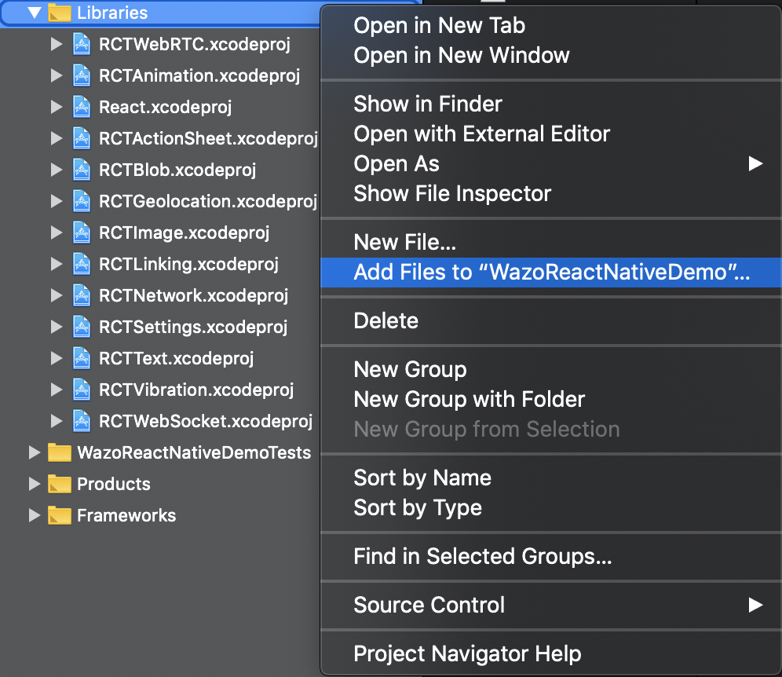
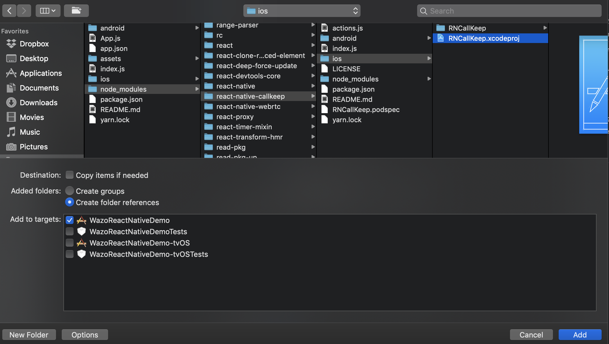
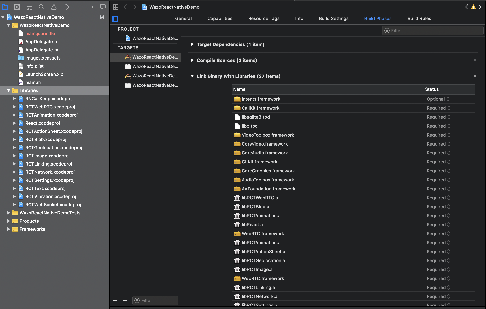
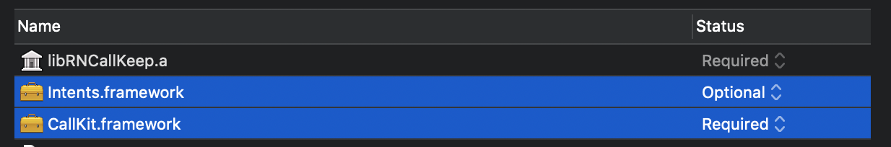

# iOS Installation

## Automatic linking

```sh
react-native link react-native-callkeep
```

## Installation with Cocoa pods

Include in a Podfile in your react-native `ios` directory:

```
pod 'RNCallKeep', :path => '../node_modules/react-native-callkeep'
```

Then:
```bash
cd ios
pod install
```

## Manual installation

### 1. Add Files To Project

1.1. In Xcode: Right click `Libraries` ➜ Add Files to `[Your project name]`.



1.2. Choose `node_modules/react-native-callkeep/ios/RNCallKeep.xcodeproj` then click `Add`.



You'll now have the Library included.


### 2. Link library in build phases

2.1. Click on `Build Phases` tab, then open `Link Binary With Libraries`.



2.2. Add `libRNCallKeep.a`.


## Common installation steps

### 1. Link required libraries

1.1. Click on `Build Phases` tab, then open `Link Binary With Libraries`.

1.2. Add `CallKit.framework` and `Intents.framework` (and mark it `Optional`).



### 2. Add header search path

2.1. Click on `Build Settings` tab, then search for `Header Search Paths`.

2.2. Add `$(SRCROOT)/../node_modules/react-native-callkeep/ios/RNCallKeep`.


### 3. Allow voip background

3.1. Open `Info.plist` file and add `voip` in `UIBackgroundModes`.


By editing this file with a text editor, your should see:

```
<key>UIBackgroundModes</key>
<array>
  <string>voip</string>
</array>
```

### 4. Updating AppDelegate.m

4.1. Import Library:

```diff
+ #import "RNCallKeep.h"
```

4.2. Handling User Activity.

This delegate will be called when the user tries to start a call from native Phone App.

Add it before the `@end` tag.

```diff
+ - (BOOL)application:(UIApplication *)application
+ continueUserActivity:(NSUserActivity *)userActivity
+   restorationHandler:(void(^)(NSArray<id<UIUserActivityRestoring>> * __nullable restorableObjects))restorationHandler
+ {
+   return [RNCallKeep application:application
+            continueUserActivity:userActivity
+              restorationHandler:restorationHandler];
+ }
```
